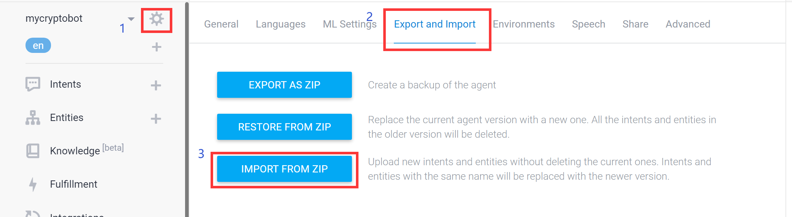

# iResearch

## Preparation

**tool**: colab

**required environment**: list in `requirements.txt`

**dataset acquisition**: 

* glove file: [link](http://nlp.stanford.edu/data/wordvecs/glove.840B.300d.zip)

* Accept classification training dataset: [link](https://drive.google.com/file/d/1pwGDi6LUKq2YPK_L8Zx0FQGoWQKjCJOj/view?usp=sharing)

## Depolyment

### Models
Model training files are located in the `iResearch/Training/folder`. All training files are written in jupyter notebook format, follow the instructions and comments to train customs model.
* **Accept classification training folder**: training model for paper accept classification module

* **Summary NER folder**: training model for paper summary generation and Scientific Named entity recognition module. After training, model would be uploaded to cloud which can be shared to public, just download from cloud hub when inference

* **Text generation training folder**: training model for text generation module.
### Dialogflow
Create a Dialogflow Agent through [link](https://dialogflow.cloud.google.com/)

Import the `iResearch_dialogflow_intent.zip` to created dialogflow agent followed by operations in figure below.
### Telegram
* 1.Create your own telegram bot and change the token in iResearch deployment.ipynb.
* 2.Follow the instructions in iResearch deployment.ipynb.
* 3.Open the PDF2json server first and then open the telegram server
### Mrt
Open the Frontend-mrt server in `Helper_Function/Helper_Function.ipynb`
### Textgrapher
Open the Frontend-textgrapher server in `Helper_Function/Helper_Function.ipynb`
